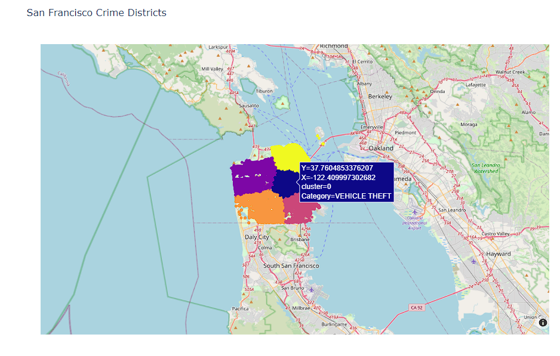

# San Francisco Crime Data Clustering

This project focuses on clustering crime incidents in San Francisco using the **K-Means** algorithm. The dataset is obtained from Kaggle and contains information about crime types, geographical coordinates, and other relevant features. The goal is to identify crime hotspots through geographic clustering and visualize the clusters on an interactive map.



## Project Overview
In this project, the **K-Means** algorithm is applied to cluster crime data based on latitude and longitude values. The crime clusters are then visualized using **Plotly** and displayed on an interactive map of San Francisco. The project involves:
- Data preprocessing and scaling
- Applying the Elbow Method to determine the optimal number of clusters
- Visualization of clusters on **OpenStreetMap** using **Plotly**
- Exporting the map as an **HTML** file for easy sharing and access

## Dataset
The dataset used in this project is the **San Francisco Crime Dataset** from Kaggle, which includes:
- Crime incident categories
- Latitude and longitude coordinates
- Timestamps and other metadata

Dataset can be found here: [San Francisco Crime Dataset](https://www.kaggle.com/c/sf-crime/data)

## Technologies Used
- **Python**: Core programming language
- **Pandas**: Data manipulation and analysis
- **Scikit-learn**: K-Means algorithm implementation
- **Plotly**: Interactive plotting and map visualization
- **OpenStreetMap**: Geographical mapping
- **NumPy**: Numerical operations
- **Elbow Method**: Finding the optimal number of clusters
- **StandardScaler**: Feature scaling

## Methodology
1. **Data Preprocessing**: Clean the dataset, extract relevant features (latitude and longitude), and handle missing data.
2. **Feature Scaling**: Apply `StandardScaler` to standardize the geographical coordinates.
3. **K-Means Clustering**:
   - Apply the Elbow Method to determine the optimal number of clusters.
   - Fit the **K-Means** algorithm on the scaled data and assign cluster labels to each crime location.
4. **Visualization**:
   - Use **Plotly** to plot crime clusters on an interactive map of San Francisco.
   - Export the map as an **HTML** file.

## Results
The clustering results show distinct geographic patterns where certain areas of San Francisco have higher crime concentrations. These clusters are visualized on the interactive map, making it easier to identify crime hotspots in different neighborhoods.

## Usage
1. Run the `crime_clustering.py` script to preprocess data, apply K-Means, and generate the visualization.
2. The output map will be saved as an `HTML` file, which can be opened in any browser.

## Installation
1. Clone the repository:
   ```bash
   git clone https://github.com/yourusername/sf-crime-clustering.git
   cd sf-crime-clustering
   ```
2. Install the required dependencies:
```bash
pip install -r requirements.txt
```
3. Run the project:
```bash
python crime_clustering.py
```
